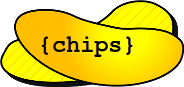

# The Chips language



Control of Hierarchical Interconnected Programmable Systems

## Why Chips?

Chips is a language to textually design complex systems with ease. Its main focus is on describing **embedded** applications for several devices in one single program.

Whatever the devices, whatever the number or the structure of the network they form, Chips will handle it, and it will give the programmer the opportunity to manage all the parameters **adaptively**.

It is a synchronous description language that is built upon the [BIP framework](https://www-verimag.imag.fr/TOOLS/DCS/bip/doc/latest/html/index.html). Chips assumes that each subroutine is either a temporarily centralized operation (which Chips calls *logical*), or a perpetually executed protocol (respectively *physical*) instanciated on each device.

Its toolchain being built using robust Model Driven Engineering methods and tools (EMF metamodels and ATL Model2Model transformations), we ensure the code generated from a Chips specification is correct regarding our language semantics (yet to be formalised). The so-said code is generated acknowledging the different nature of the model's elements.

The Chips language takes its root in the design of block schema representation of complex systems, and allows to modelize such systems with a syntax that mixes C-style definition of functions with dataflow logics.

## Chips typical usage

- Simulation of Block Diagram models according to Chips specification,
- Easy generation of large BIP models when their desired architecture matches the Chips semantics,
- C++ code generation for Chips Models to embark on real hardware,
- JavaBIP code generation for interfacing with other Java applications like microservices (yet to be integrated).

## Current state of the project

- A parser is implemented for the language, separately from the rest of the compile chain. It generates ```.xmi``` serialized versions of Chips models.
- ATL transformations are developped for turning ```.xmi``` serialized versions of Chips models into ```.xmi``` serialized versions of equivalent (yet to prove) BIP models. Such transformations are based on the ```chips1.1.ecore``` and ```BIP.ecore``` metamodels. They are 
  - fully integrated to the compile chain, 
  - but not complete yet (missing interpretation of network architecture, dataflows and collective primitives)
- A forked version of the BIP compiler is provided. It has been modified to be able to either read ```.bip``` files or ```.xmi``` serialized versions of BIP models. It is also integrated to the compile chain.


## Installation (On Unix based systems)

(Currently, no other OS is supported)

Before anything, make sure you have all the following software in a recent enough version (who still uses java 1.7 anyway?) installed on your machine:
``` 
git g++ gcc make cmake build-essential curl bash ant java
```

Once all these softwares are installed with the method of your choic, open a terminal and run:
```bash
cd <path to your desired installation location>
git clone git@github.com:NwaitDev/Chips_Public.git
cd Chips_Public/ChipsCompiler/FullCompileChain
./build.sh # Compiles all the sources (Chips Parser + ATL transformations + BIP Compiler)
source setenv.sh # Defines Environment variables to run the compiler
```

## Running the compiler

The compiler CLI is available in the form of a bash script:
```<Installation path>/Chips_Public/ChipsCompiler/FullCompileChain/chipsc.sh```.

Feel free to make your own alias or simlink for this program.

## Documentation Links

- [Users documentation](./documentation/UsersDocumentation/UD0_Introduction.md)
- [Developers documentation](./documentation/DevelopersDocumentation/DD0_Introduction.md)

## Upgrades for next versions of Chips 

- Adding MACROS ?
- Generation of Block Diagrams PNG from Chips specs ? <3 
- adding collective primitives to the base syntax to integrate aggregate programming features
- aliases to apply dimensionnal analysis on top of the type checking
- Object orientation of the language (interfaces, inheritance, object composition)
- Enumerations for contextually named integers (see TeaStore implementation)
- Syntaxic coloration for Chips and some code snippets
- Function wrapping in different files
- new syntax for easier usage of physical interfaces ?
- Pure addition and extension (syntactic sugar)
- multiple devices node implementation
- external chips libraries/packages

## License
I have no idea of what license to use, I'm just a poor little PhD student 

## Project status
Ongoing project