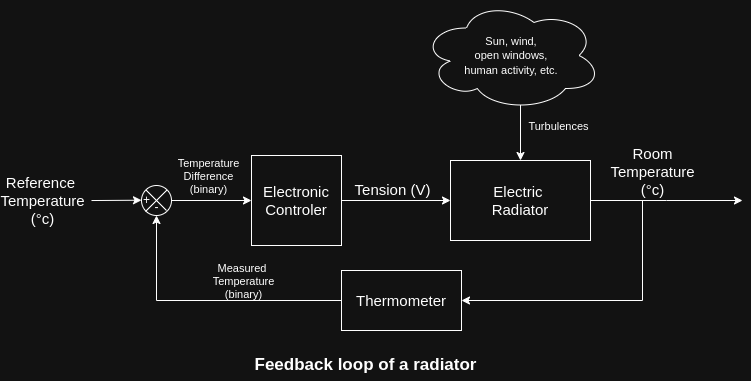
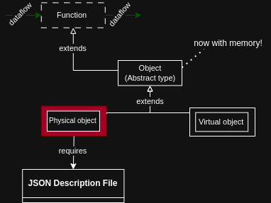
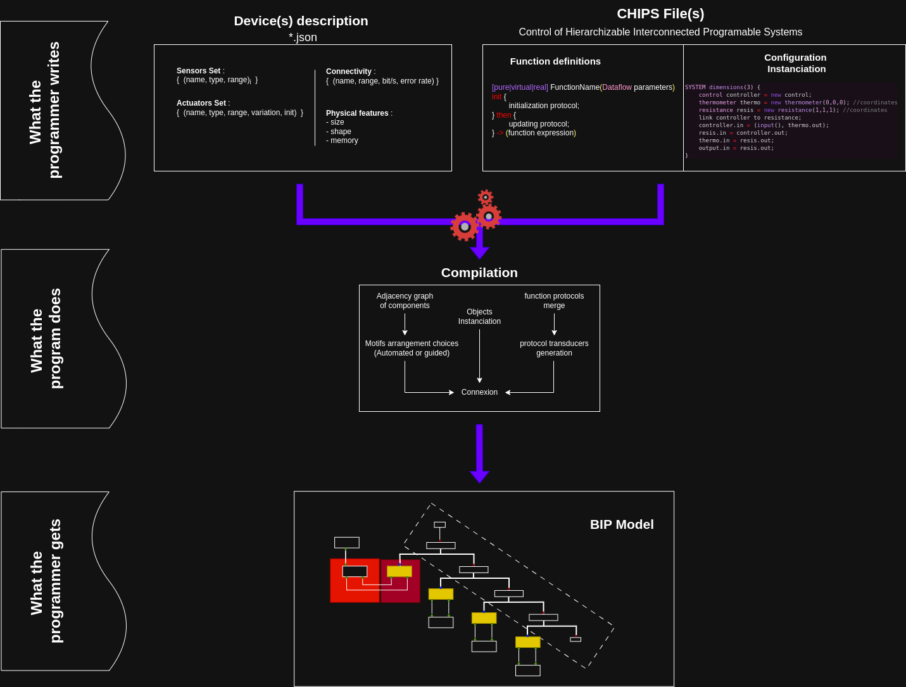

# Chips

# The Chips language


Control of Hierarchical Interconnected Programmable Systems

## Why Chips?

Chips is a language to textually design complex systems with ease. Its main focus is on describing **embedded** applications for several devices in one single program.

Whatever the devices, whatever the number or the structure of the network they form, Chips will handle it, and it will give the programmer the opportunity to manage all the parameters **adaptively**.

It is (going to be) a strongly typed language with the particuliarity of being **functionnal (and soon, object oriented)**. Chips assumes that each subroutine is either a mathematical function, a temporarily centralized operation, or a perpetually executed protocol instanciated on each device.

The Chips language takes its root in the design of block schema representation of complex systems, and allows to modelize such systems with a syntax that mixes C and Mathematical description of functions. 

$$
    \begin{cases}
        f : & \mathbb{R} & \rightarrow &  \mathbb{R}\\
        & x & \rightarrow & 3 x
    \end{cases}
$$

would be written:

```cpp
pure f(float x) -> (3*x)
```


When an engineer wants to test a system they designed using a functionnal block representation such as the following image, chips allows to code the functions directly as they are in the diagram.




The associated code would look like this:

```cpp

import "thermometer.json" as thermometer;

pure pid(float error, float ierror, float derror) 
		-> (2*error+3.2*ierror+0.4*derror)

pure errorf(float expected, float received) 
		-> (expected - received)

// control operation from the control theory perspective
virtual control(float expected, float received) init {
    float derivative = 0;
    float integral = 0;
    float lasterror = 0;
    float error = 0;
    float out = pid(error, integral, derivative);
} then {
    error = errorf(expected, received);
    derivative = (lasterror-error)/dt;
    integral = integral+error*dt;
    lasterror = error;
    out = pid(error, integral, derivative)
} -> (out)


pure input() -> (23) // 23°c required by the user
pure output(float any) -> (any) // temperature in the room

physical resistance.json resistance(float voltage, float roomTemp) init {
    float resTemp = roomTemp; // in °c
} then {
    resTemp = (resTemp + voltage*this.roomSizeFactor + roomTemp)/2;
} -> (resTemp)


physical thermometer(float roomTemp) init {
    int delay = 10;
    float [] temperatureOverTime = floatarray(delay, roomTemp);
} then {
    for(int i = delay-1; i>0; --i){
        temperatureOverTime[i]=temperatureOverTime[i-1];
    }
    temperatureOverTime[0] = roomTemp;
} -> (temperatureOverTime[delay-1])


SYSTEM dimensions(3) {
    control controller;
    thermometer thermo; //coordinates of the thermometer in the space
    resistance resis; //coordinates of the resistance in the space

    link controller to resis;

    controller.in(input.out, thermo.out);
    resis.in(controller.out);
    thermo.in(resis.out);
    output.in(resis.out);

    thermo at (0,0,0);
    resis at (1,1,1);
}
```

## Types

Chips is integrating two different categories of types : dataflow types, and function types.


### Dataflow types

On the one hand, dataflow types are a set of usual primitive types found in most programming languages:

- **int** for relative numbers;
- **float** for floating point values;
- **bool** for true and false;
- **\<type>[]** for dynamic dataflow arrays;

These data types serve as input and output types for all the components of the complex systems.

### Function types

On the other hand, function types are there to give context to the operations:

- **pure** is the type for mathematical constructs that need no physical support (i.e. devices) to exist or being defined. They only treat dataflows.
- **physical (object)** is the type for procedures that are, by default, embodied in physical devices. A **physical** is always associated to a json file describing the capabilities and features of the device.
- **virtual (object)** is the type of the procedures that may independently be instanciated on any device of the system.

Actually, each one of these types can be seen as functions, except that :

- objects have a memory for additionnal treatment,
- real objects are to be placed in space,
- virtual objects have to be linked to at least one real object with enough memory associated for their instanciation.



On top of these function types, the language will implement **\<object type>[]** for arrays containing many functionnal blocks at the same time, thus allowing loop construction of systems when many virtual or real components are used.


## About the compilation



## Current state of the project

Currently, The language can be recognized by the parser, but type check operations are not completed and no complete data structure for a model is available.
There is still a need to code the BIP object file generator and physical coherence check for a system (no overlapping of physical devices).

The target language for the compilation will be BIP (in order to more easily prove properties of the system designed). The compiler will probably be written in C++ because its data types can be imported in BIP. 


## Upgrades for next versions of Chips 

- Adding MACROS ?
- adding collective primitives to the base syntax to integrate aggregate programming features
- aliases to apply dimensionnal analysis on top of the type checking
- Object orientation of the language (interfaces, inheritance, object composition)
- Enumerations for contextually named integers (see TeaStore implementation)
- Syntaxic coloration for Chips and some code snippets
- Function wrapping in different files
- new syntax for easier usage of physical interfaces ?

## Authors and acknowledgment
Designed and implemented by Anna <3
Thesis project supervised by O. Kouchnarenko, S. Cerf And S. Bliudze

## License
I have no idea of what license to use, I'm just a poor little PhD student 

## Project status
Ongoing project