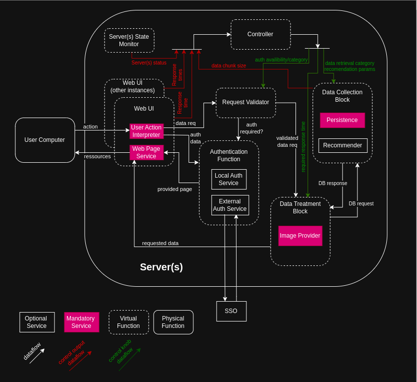
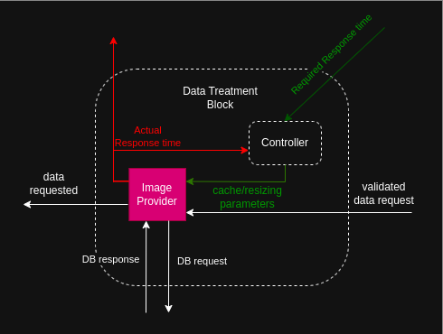
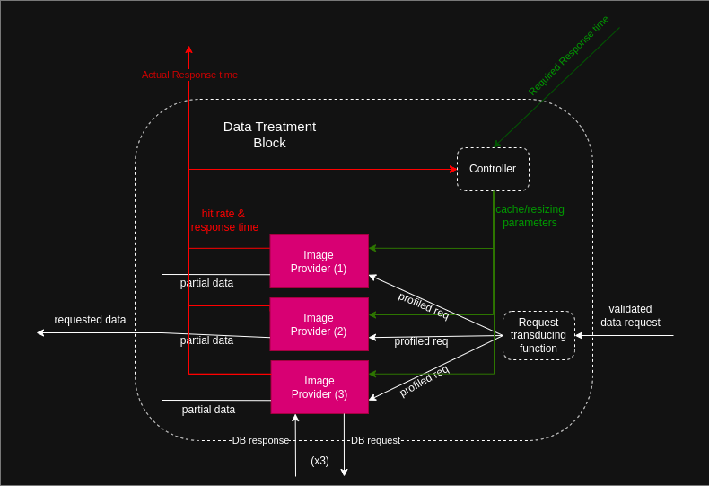
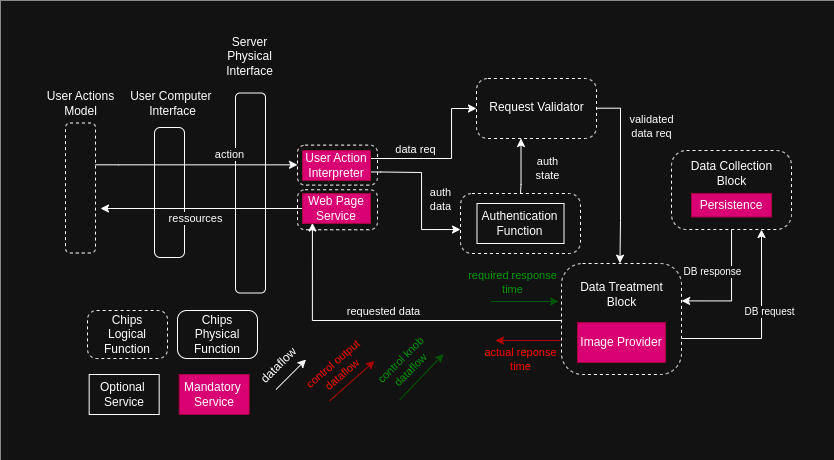

# About this model

Model written for the Workshop on Adaptable Cloud Architectures (WACA) of the DisCoTec2025 conference.
Since the model had to be written in a short amount of time before the conference submission, its Chips implementation is *not rigorously* coded.

## About the Chips version

Some constructs were used even if not properly defined by the current language specifications (for example, *enumerations* and *switch*).
Those chips examples were more written to be readable than compilable.
Maybe, someday, some beautiful day, a complete Chips compiler will exist and compile that code into a proper BIP model.

Here is the diagram on which the Chips development was based:

Finally, the version kept for WACA was much simpler because it only cares about one signal, and no hierarchy is used for the controllers. The general controller was removed, only to keep a controler at the level of the data treatment block.

This component, however is still a little more developped in the Chips file (syntax not ready though). It is described as having potentially many cache blocks at disposal. The data treatment block could then be represented this way:

## About the BIP version

The BIP model is simpler than the one described with Chips because it focuses on the signals that were analyzed for WACA.
It is mainly copied/pasted then refactored Chips.

The BIP model can be represented by this diagram :

